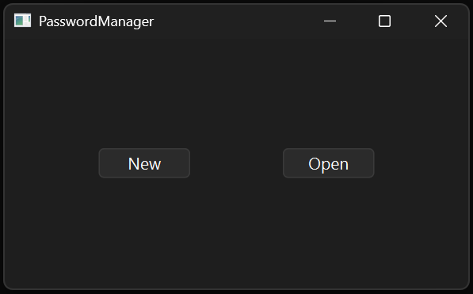
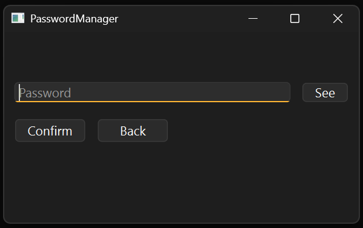
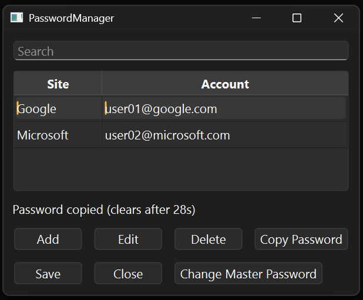
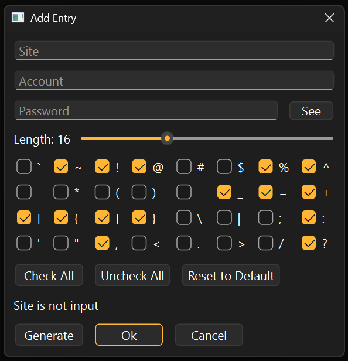
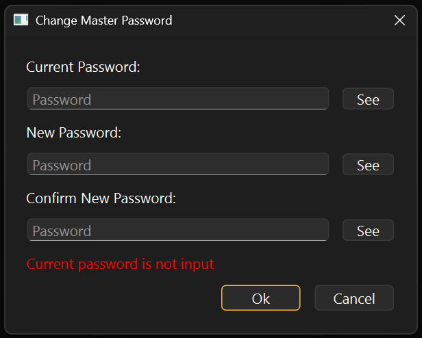

# 1. Introduction

GUI encrypted password file manager using AES-256-GCM and Argon2id, and Qt6.

 </br>
  </br>


# 2. Features

* AES-256-GCM for vault encryption and integrity check
* Argon2id for key derivation from master password
* Qt6 graphical user interface
* Vault is never written to disk in plaintext; unverified plaintext exists only in locked memory
* Random password generator with customizable length and special characters
* Automatic clipboard clear after 30 seconds of password copy
* Search and filter entries by keyword
* Cross-platform support for Windows and Linux

## 2-1. Cryptographic Choice

* **AES-GCM**
	* **AES**
		* Most used encryption algorithm, de facto industry standard
		* Chosen by NIST, trusted by many governments and corporations
		* Modern processors support hardware acceleration for AES
	* **GCM**
		* Does not require padding, immune to padding oracle attack
		* Can be parallelized in both encryption and decryption process 
		* Provides both confidentiality and integrity using AEAD

* **Argon2id**
	* Winner of 2015 Password Hashing Competition
	* Hybrid of Argon2i and Argon2d, balances strength of both algorithms
		* Argon2i: Data independent memory access, resistant to side channel attack
		* Argon2d: Memory hard function, resistant to brute force attack using GPU or ASIC

## 2-2. Security Considerations

* Automatic clipboard clear after 30 seconds
* Copied passwords are excluded from OS clipboard history and cloud clipboard sync
* Constant time password comparison
* GCM tag provides integrity check
* Key commitment stored in the header separates a wrong master password from a damaged vault, which a GCM tag cannot do on its own
* The whole plaintext header is the associated data of the vault, so an edit to it fails the tag
* Newly and randomly generated initial vector for each session, using OS-provided CSPRNG (`BCryptGenRandom`/`getrandom`)
* Password generator guarantees at least one each of uppercase, lowercase, digit, and special character
* RAII pattern ensures memory wipe for sensitive data, using `sodium_free` and `sodium_memzero`
* Range check for key derivation parameters before Argon2id runs
* Sensitive data is held in `sodium_malloc` memory, which provides guard pages and lock against swap
* Vault files are re-encrypted with new initial vector for each save or master password change

# 3. Specifications

* **AES-256-GCM**
	* **IV Size:** 96 bits (recommended for AES-256-GCM)
	* **Key Size:** 256 bits (using AES-256)
	* **Block Size:** 128 bits (using AES)
	* **Authentication Tag Size:** 128 bits
	* **Associated Data:** the 65-byte plaintext header

* **Argon2id**
	* **Memory Cost:** 512 MiB
	* **Time Cost:** 4 iterations
	* **Parallelism:** 4
	* **Salt Size:** 128 bits
	* **Derived Output:** 512 bits, split into a 256-bit key and a 256-bit key commitment
	* **Accepted Header Range:** 64 MiB to 2 GiB memory, 1 to 8 iterations, 1 to 8 lanes
	* Parameters are stored in the vault header, so a vault stays readable after the defaults change
	* A vault adopts the current defaults when it is created or when the master password is changed

* **Entry**
	* **Maximum Site Name Length:** 256 bytes
	* **Maximum Account Length:** 256 bytes
	* **Maximum Password Length:** 256 bytes

* **Vault**
	* **Maximum Vault File Size:** 2 GiB
	* **Maximum Master Password Length:** 256 bytes

## 3-1. Vault File Format

**Vault Format:** 
```
Header (65 Bytes) | IV (12 Bytes) | Encrypted Data | Tag (16 Bytes)
```

### 3-1-1. Header

65 bytes, plaintext, and the associated data of the single AES-256-GCM pass that follows.

| Offset | Size | Field       | Encoding                                 |
|-------:|-----:|-------------|------------------------------------------|
| 0      | 4    | Magic       | `D1 74 2C 9E`                            |
| 4      | 1    | Version     | uint8, currently 1                       |
| 5      | 4    | TimeCost    | uint32 little-endian                     |
| 9      | 4    | MemCost     | uint32 little-endian (KiB)               |
| 13     | 4    | Parallelism | uint32 little-endian                     |
| 17     | 16   | Salt        | raw bytes                                |
| 33     | 32   | Commitment  | raw bytes, second half of the derivation |

The two properties this buys are separate and worth keeping separate.

The **key commitment** says which master password a vault belongs to. AES-GCM is not key-committing, so a tag that fails cannot distinguish a wrong password from a damaged file, and this program used to report both as one sentence. The commitment is the second half of the same Argon2id derivation that produces the key, so it costs no additional derivation, and it is compared before anything is decrypted: a mismatch is reported as a wrong password, and any failure after it as a corrupted vault.

The **associated data** says that these bytes have not been edited since the vault was written. The salt and the parameters were already bound to the ciphertext by the derivation they feed, and the magic number is checked before it is used; what the associated data adds is the commitment, which nothing else protects, and every field the format may grow later. It does not make the header trustworthy before it is used — see the limitation noted in 3-3.

Vault files written before this format are not supported. Their magic number is recognised so they can be reported as old rather than as foreign.

**Encrypted Data Format:** 
```
Entry Count (4 Bytes) | Entries
```

**Entry Format:** 
```
Site Name Length (4 Bytes) | Site Name | Account Length (4 Bytes) | Account | Password Length (4 Bytes) | Password
```

**Entry Example:** 
```
{ 
	site: "Google", 
	acc: "username@google.com", 
	pw: "password" 
}
```

## 3-2. Source Code Architecture

```
src
├── common
│   ├── constants.h            # Constant values
│   └── main.cpp               # Application entry point
├── core
│   ├── aes_gcm.h/cpp          # AES-GCM engine
│   ├── aes_gcm_enc.cpp        # Encryption implementation
│   ├── aes_gcm_dec.cpp        # Decryption implementation
│   ├── entry.h/cpp            # Password entry struct with serialization
│   ├── secure_buffer.h/cpp    # Secure locked buffer
│   ├── secure_key.h/cpp       # Secure AES key and key commitment handler
│   ├── vault.cpp              # Vault basic functions
│   ├── vault_file.cpp         # Vault file management (new, open, save)
│   ├── vault_entry.cpp        # Vault entry CRUD operations
│   └── vault_header.h/cpp     # Plaintext vault header layout and validation
├── gui
│   ├── entry_interface.h     # Interface of Entry class
│   ├── main_gui.h/cpp         # Main workflow controller
│   ├── login_gui.h/cpp        # Vault file selection
│   ├── password_gui.h/cpp     # Master password input
│   ├── list_gui.h/cpp         # Entry list with search line
│   ├── entry_gui.h/cpp        # Entry add/edit dialog with password generator
│   ├── change_pw_gui.h/cpp    # Master password change dialog
│   ├── pw_line_edit.h/cpp     # Password input component with show/hide toggle
│   └── vault_interface.h/cpp  # Interface of Vault class
└── utils
    ├── password.h/cpp         # Secure password container
    ├── platform.h             # Utility function declarations
    ├── platform.cpp           # Common utility functions
    ├── platform_linux.cpp     # Linux utility functions
    └── platform_win32.cpp     # Windows utility functions
```

## 3-3. Limitations

* Argon2id runs at the cost the vault file asks for, before anything in that file has been authenticated. A file supplied by an attacker can therefore spend up to 2 GiB by 8 iterations by 8 lanes of work on the machine that opens it. Neither the key commitment nor the authenticated header prevents this, since both are compared after the derivation they would have to precede; the accepted range in the header is the only bound on it
* No CLI mode (GUI only)
* No key file support (Password only)
* No cloud sync (Local vault file only)
* No auto-lock on idle
* No auto-type (clipboard only)

# 4. Build and Usage
## 4-1. Prerequisites

**Windows:**
* Visual Studio 2022+ with the "Desktop development with C++" workload
* CMake 3.16+
* vcpkg
* Qt 6.7+

**Linux:**
* GCC 11+ or Clang 14+
* CMake 3.16+
* Qt6 development packages

Dependencies (OpenSSL 3.0+, Argon2, libsodium, Google Test) are declared in
`vcpkg.json` and installed automatically when building with the vcpkg toolchain.

## 4-2. Build

**Windows** (vcpkg manifest mode — dependencies are resolved from `vcpkg.json`):
```cmd
cd Projects\PasswordManager

cmake -B build ^
  -DCMAKE_TOOLCHAIN_FILE=%VCPKG_ROOT%\scripts\buildsystems\vcpkg.cmake ^
  -DVCPKG_TARGET_TRIPLET=x64-windows ^
  -DCMAKE_PREFIX_PATH=C:\Qt\6.7.0\msvc2019_64

cmake --build build --config Release
```
Replace `CMAKE_PREFIX_PATH` with your Qt installation path.

**Linux** (system packages):
```bash
sudo apt-get update
sudo apt-get install -y qt6-base-dev libssl-dev libargon2-dev \
                        libsodium-dev libgtest-dev

cd Projects/PasswordManager
cmake -B build -DCMAKE_BUILD_TYPE=Release
cmake --build build
```

**Linux** (vcpkg): libsodium must be linked dynamically, so an overlay triplet
is supplied in `triplets/`:
```bash
cd Projects/PasswordManager

cmake -B build \
  -DCMAKE_BUILD_TYPE=Release \
  -DCMAKE_TOOLCHAIN_FILE="$VCPKG_ROOT/scripts/buildsystems/vcpkg.cmake" \
  -DVCPKG_TARGET_TRIPLET=x64-linux-dynsodium \
  -DVCPKG_OVERLAY_TRIPLETS="$PWD/triplets"

cmake --build build
```

**Build Options:** 

| Option     | Default | Description                                   |
| ---------- | ------- | --------------------------------------------- |
| `COVERAGE` | `OFF`   | Coverage instrumentation (GCC/Clang)          |
| `SANITIZE` | `OFF`   | AddressSanitizer + UndefinedBehaviorSanitizer |

Either option works with any build type. CI builds coverage as `Debug` and the sanitizers as `RelWithDebInfo`:
```bash
cmake -B build -DCMAKE_BUILD_TYPE=RelWithDebInfo -DSANITIZE=ON
cmake --build build
```

## 4-3. Usage











1\. Run the executable `PasswordManager.exe` or `PasswordManager`
2\. Create a new vault or open an existing vault
3\. Enter master password
4\. Add, edit, or delete password entries
5\. Click Save to encrypt and store the vault

# 5. Testing
## 5-1. Coverage


**Codecov Report:** https://app.codecov.io/gh/Astatine387/Portfolio/tree/main/Projects%2FPasswordManager%2Fsrc

| Module   | Test File              | Test Cases                                                                                                                       |
| -------- | ---------------------- | -------------------------------------------------------------------------------------------------------------------------------- |
| AesGcm   | `aes_gcm_test.cpp`     | Encryption, Decryption, Authentication, Associated Data, Integrity Check, Edge Cases, Error Callback                             |
| Entry    | `entry_test.cpp`       | Size Calculation, Comparison, Serialization, Deserialization, Boundary Check, Field Length Validation                            |
| Password | `password_test.cpp`    | Initialization, Setting Data, Copy and Move Semantics, Memory Safety, RAII, Comparison, Data, Cleanup, Maximum Size, Memory Lock |
| Utils    | `utils_test.cpp`       | File Handling, Argon2id Key Derivation, Random Number Generation, Memory Wipe                                                    |
| Vault    | `vault_entry_test.cpp` | Entry CRUD Operation, Duplication Check, Existence Check, Conflict Check, Accessor, Master Password Verification                 |
| Vault    | `vault_file_test.cpp`  | Vault Creation, Opening, Validation, Header Parameters, Header Tampering, Save, Password Change, Error Handling                  |

**Note:** GUI files, error messages for external libraries and system calls are excluded from tests.

## 5-2. Running Tests

**Windows:**
```cmd
cd Projects/PasswordManager
ctest --test-dir build -C Release --output-on-failure
```

**Linux:**
```bash
cd Projects/PasswordManager
ctest --test-dir build --output-on-failure
```

## 5-3. Continuous Integration

| Check                        | Windows     | Linux     |
| ---------------------------- | ----------- | --------- |
| Build                        | ✅ MSVC 2022 | ✅ GCC 11+ |
| Unit Tests                   | ✅           | ✅         |
| Format Check (clang-format)  | -           | ✅         |
| Static Analysis (cppcheck)   | -           | ✅         |
| Static Analysis (clang-tidy) | -           | ✅         |
| Coverage Report              | -           | ✅ Codecov |
| AddressSanitizer (ASan)      | -           | ✅         |

# 6. License

* This project is licensed under the MIT License. See [LICENSE.md](LICENSE.md) for more details.
* This project uses the following third-party libraries. See [LICENSES-THIRD-PARTY.md](LICENSES-THIRD-PARTY.md) for more details.
	- OpenSSL (Apache 2.0)
	- Argon2 (CC0/Apache 2.0)
	- Qt (LGPL v3)
	- Google Test (BSD 3-Clause)
